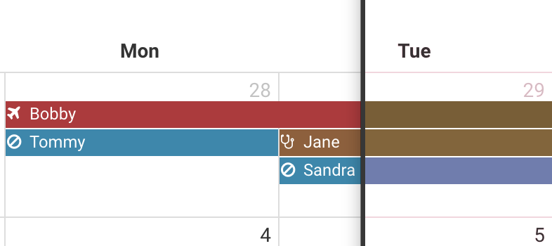

title: Designing Interfaces for Everyone
author:
  name: Guy Bianco IV
  email: gbianco@redhat.com
  twitter: gjbiancoiv
  url: http://guy.sh
controls: true
theme: gjbianco/cleaver-dark-alt
style: 'custom.css'

--
# Designing Interfaces for Everyone
--
# "Designing for everyone" means accessibility
--
# Accessibility is a very wide topic
--
# Let's talk about colorblindness
--
### Who is affected?
 - Much more common in men (usually by orders of magnitude)
 - About 8% of men are color blind
 - Probably at least one person watching this
 - Probably at least one person at your client
--
### Types of Color Blindness
 - Red-green confusion (most common)
 - Yellow-blue confusion
 - Monochromacy
--
# What we want to avoid
--
### Which button is which?
</img>
--
# Not only annoying, but can be dangerous!
--
# How do we avoid this?
--
# Naive approach is tweaking color scheme
--
# There is no "magic color scheme" that works for everyone
 

there will always be somebody who can't see it

--
# Remember that color coding is a *convenience*
 

it shouldn't be the only source of a piece of information

--
# So how do we make colorblind accesssible interfaces?
--
### Use WELL KNOWN positions

</img>

We rarely get to use this convenience in software

--
### Using distinct but consistent patterns

</img>

Really useful when text doesn't make sense or fit

--
### Use symbols to also represent information

</img>
--
### Include the data with the colors

</img>

--
# The most important thing is to consider EVERYONE in your audience
--
### References
Prevalence stats: http://www.colour-blindness.com/general/prevalence/

Sim Daltonism (simulator app): https://michelf.ca/projects/sim-daltonism/